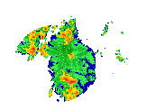

# Arpav Downloader

Download radar images from https://www.arpa.veneto.it/bollettini/meteo/radar/index_geo.php provided by Arpav.



Set up a cronjob that fetches new radar images every 10 minutes:
```bash
sudo crontab -e
# Insert
*/10 * * * * cd /root/arpav && python3 run.py >> log.txt
```
